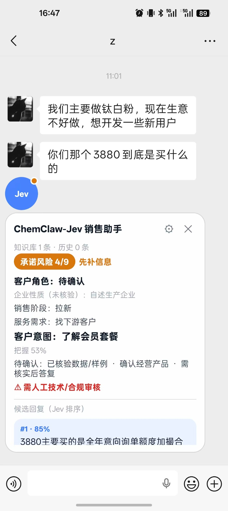
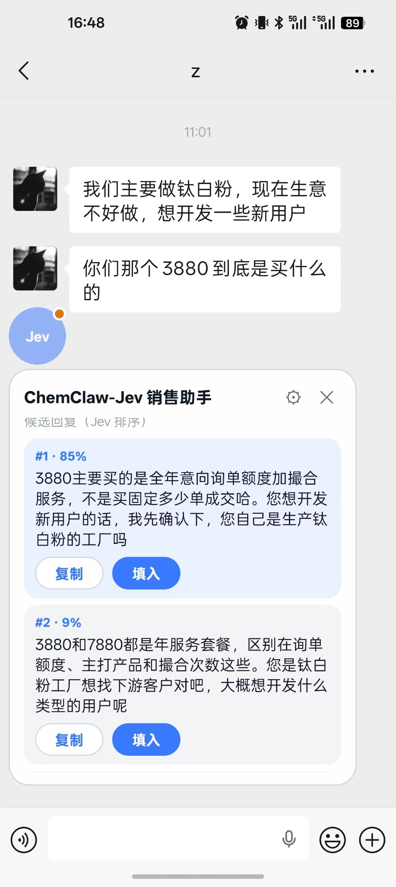

# ChemClaw-Jev 销售助手

**芯化和云内部业务员使用的 AI 销售与商机开发助手。** 以 Jev 判断模型为业务决策核心，帮助业务员从聊天中理解采购商、供应商的实际需求，推进真实询盘、供采匹配与「每日询单」套餐销售。当前为 Android 第一阶段开发版本，**并非已经上线的公司生产系统**。

> 本仓库 Fork 自 [jev-chat/jev-chat-jarvis](https://github.com/jev-chat/jev-chat-jarvis)。原项目 README 保留在 [docs/upstream-readme.md](docs/upstream-readme.md)，上游版权与许可证见 [LICENSE](LICENSE)。上游原有聊天采集与无障碍实现仍需要在目标手机及聊天 App 版本验收。

## 下载 APK（Android）

[⬇️ 下载 ChemClaw-Jev.apk（v0.1.0）](https://github.com/zoeyzhang233666/jev-chat-jarvis/releases/download/v0.1.0/ChemClaw-Jev.apk)（约 28.1 MB）

也可前往 [GitHub Releases 发布页面](https://github.com/zoeyzhang233666/jev-chat-jarvis/releases/tag/v0.1.0)，在 **Assets** 中点击 `ChemClaw-Jev.apk` 下载。无需自行编译。

### 手机安装步骤

在 Android 手机上点击上面的链接下载 APK → 打开系统“下载”或文件管理器中的 APK → 按提示安装。如系统要求“允许安装来自此来源的应用”，请确认下载链接来自本仓库后再对浏览器或文件管理器授权。安装后请先配置获得授权的模型服务，并检查所需的无障碍和悬浮窗权限；当前仍是开发/测试版本，使用前请验收实际功能。

## 效果展示

在微信聊天界面通过 Jev 悬浮窗查看销售分析结果，并选择合适的候选回复；回复由业务员确认后手动复制或填入。

<table>
  <tr>
    <td align="center" width="50%"><br><sub>客户意图、销售阶段与风险提示</sub></td>
    <td align="center" width="50%"><br><sub>Jev 排序的候选回复：复制或填入</sub></td>
  </tr>
</table>

## 当前开发状态

- 当前主分支：`main`（已包含原 `feature/xinhua-sales-jev` 的开发成果）
- 原开发分支：[feature/xinhua-sales-jev](https://github.com/zoeyzhang233666/jev-chat-jarvis/tree/feature/xinhua-sales-jev)（保留供历史参考）
- 原开发评审：[PR #2：ChemClaw-Jev 销售助手](https://github.com/zoeyzhang233666/jev-chat-jarvis/pull/2)
- 详细业务决策与验收场景：[docs/xinhua-sales-jev-v1.md](docs/xinhua-sales-jev-v1.md)

### 它帮助业务员做什么？

| 客户场景 | Jev 判断 | 业务员动作 |
| --- | --- | --- |
| 采购商寻找原材料 | 采购产品、规格/品牌、采购量、收货地和时间是否齐全 | 逐项挖掘询盘，核验后交运营中心 |
| 供应商想找下游工厂 | 主营产品、目标行业/地区、工厂与贸易商偏好 | 查询芯化和云企业/供采数据，安排有授权的人工筛选 |
| 供应商需要真实询单 | 当前需求、询单是否明确、是否只是了解行情 | 展示有来源的真实询盘，说明订阅和撮合服务 |
| 客户对数据准确性、效果、平台或费用有疑问 | 销售阶段、明确异议和仍缺的信息 | 给出证据、服务说明或申请人工复核 |
| 客户了解会员权益 | 客户需要的询单额度、主打产品、订阅产品等 | 解释 3880 / 7880 套餐实际权益 |

### 已有功能（当前 main）

1. 继续使用原项目的 Android 聊天采集、OCR、可移动悬浮窗、设置页、知识库、模型请求客户端及人工填入回复。**程序不自动发送消息、付款或下单。**
2. Jev 在一次请求内判断 13 项业务信号：客户供采角色、自述公司性质、销售阶段、服务方向、客户意图、异议、缺失信息、询盘状态、建议动作等。企业是工厂还是贸易商不能只靠聊天判定为“已核验”。
3. Jev 先判断，再由生成模型结合确认的套餐权益生成三条候选话术，然后 Jev 带着销售阶段和下一步动作对话术排序。
4. 悬浮窗展示角色、阶段、服务需求、异议、询盘状态与建议动作。
5. 加入 GitHub Actions Android debug APK 构建工作流。构建情况以对应 Actions 记录为准，**不能用代码提交代替 APK 或真机验收**。

## 套餐资料（当前已确认）

| 项目 | 每日询单企业基础版 | 每日询单企业专业版 |
| --- | ---: | ---: |
| 价格 | **¥3880** | **¥7880** |
| 有效期 | 12个月 | 12个月 |
| 经筛选的意向询单额度 | 45条/年 | 90条/年 |
| 主打产品 | 10个 | 30个 |
| 订阅产品 | 50个 | 200个 |
| 专家撮合服务 | 10 | 25 |
| 企业认证专属标签 | 无 | 有 |
| 行业顾问咨询、积分兑现 | 有 | 有 |
| 供应链金融服务 | 无 | 有 |

询单额度不等于保证成交单数。扣费、退款、积分、超额及交付细则须核对芯化和云**现行合同**，不得凭旧话术自动作出商业承诺。

## 与「问数」及 MCP 的关系

公司已有「**问数：千万化工数据，一句话查询**」和 MCP 数据平台。ChemClaw-Jev 的目标架构是：

```text
业务员当前对话 / 已授权客户上下文
            ↓
  Jev：判断角色、意图、阶段和下一步动作
            ↓
  如需数据 → 内部受控服务端 → 问数 / 数据 MCP
            ↓
  返回有权限、有来源的数据或明确的无结果
            ↓
生成模型起草3条回复 → Jev选择回复 → 业务员核对后手动发送
```

**重要：当前版本尚未连通问数、CRM 或公司 MCP。** Jev 的 `query_wenshu` 当前只是“建议查询”动作，不能声称实际已查到数据；也不会把任何员工 API Key 写进手机源码或公开仓库。L3/L4 客户、成交和会员类数据需要遵守公司既有授权边界。

企业微信采集适配、电话记录录入、实际企业/询盘结构化数据、权限网关和真实 MCP 结果回填仍属后续工程。

## 构建与调试

项目基于 Kotlin + Android View/XML，JDK 17、Android SDK 35。

```bash
./gradlew assembleDebug
```

安装到业务员手机之前，请先检查 GitHub Actions 构建结果，再验证 Jev/生成模型 API、无障碍服务、微信聊天采集、悬浮窗、数据安全及手动发送流程。密钥只在获得授权的配置渠道中保存，**不要提交到 GitHub**。

## 业务使用边界

不得虚构真实采购询单、客户案例、工厂身份、价格、企业数据规模与成交概率；区分数据推测与人工核验；保护客户联系方式和商业资料；涉及化工安全、合规、合同和退款要求时由有权限的人员核实。
